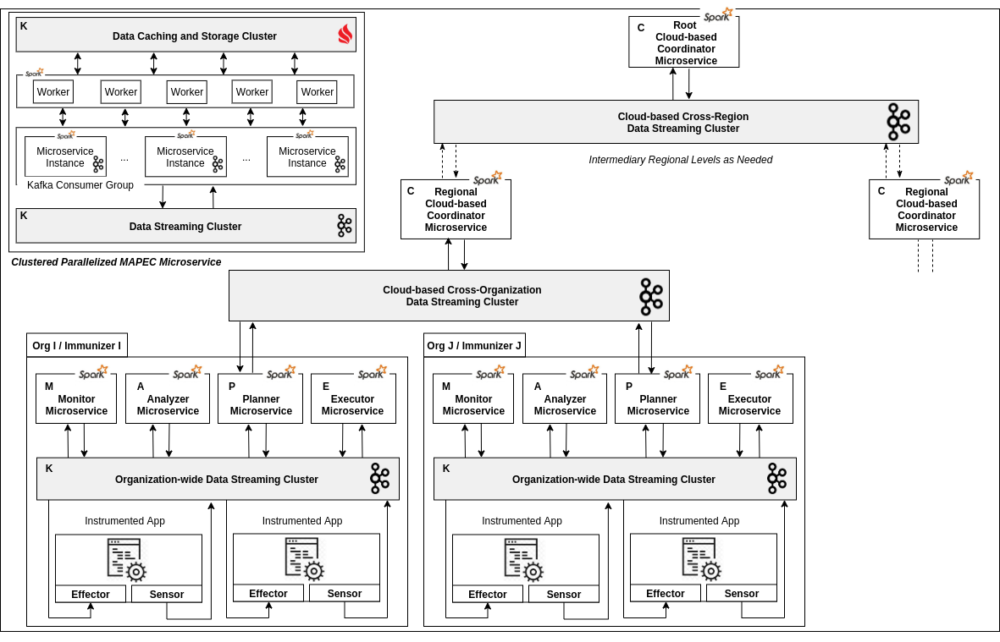

# Communizer: A Collaborative Cloud-based Self-Protecting Software Communities Framework

Popular software has always been appealing to adversaries, as related vulnerabilities are synonymous with millions of exposed businesses. Collaborative intrusion detection, as well as software self-protection try to alleviate this situation, but lack either autonomy and adaptation or Internet-scale oversight and mitigation.

Communizer is a collaborative cloud-based framework that creates communities of self-protecting software across organizations. It allows community members to turn their common weaknesses into collaborative and proactive self-protection, by empowering them to detect intrusions, exchange alerts and anticipate attacks. To this end, we extend the autonomic computing model, as implemented by our [Immunizer framework](https://github.com/oiraqi/immunizer), by integrating multiple MAPE-K control loops through cloud-based coordination. We adopt a hierarchical, clustered, parallelized and asynchronous microservice architecture. This unique combination strives to optimize scalability, maintainability and resilience, without compromising privacy or accuracy.

We also designed a trust-based multi-level alert coordination system, as well as a lightweight alert coordination message exchange format. In particular, our coordination system addresses insider attacks by detecting and blacklisting untrustworthy members. It also identifies and neutralizes selfish members through a specifically designed probabilistic model.

The analysis, optimization and evaluation of our framework show a drastic reduction of the monitoring load on community members, while ensuring a high attack detection rate, even for small-scope attacks.

## Architecture

  

